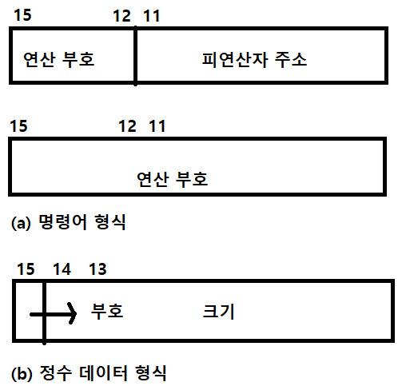

? 연상부호, 연산부호

# 명령어 집합
컴퓨터가 작업을 수행하려면 인식할 수 있는 명령어가 있어야 함. 

## 명령어 집합

### 명령어 집합의 의미
프로그램은 높은 프로그래밍 생산성, 컴파일 오류 탐지 및 유지보수의 용이함 등과 같은 장점을 가진 고급언어로 작성된다. 하지만 프로그램은 컴파일러나 인터프리터 등을 통해 기계 명렁어로 변환되어야만 인식되거나 하드웨어에서 실행될 수 있다.

- 명령어 : CPU 가 수행할 동작을 2진수 코드로 정의한 것. 일반적으로 연상부호를 사용한 어셈블리 형태로 표현함.
- 명령어 집합 : 특정 CPU 를 위해 정의된 명령어의 모음

### 명령어 집합 구조
- 명령어 집합 구조(Instruction set architerture) : 프로그램을 수행할 하드웨어 시이의 인터페이스에 대한 완전한 정의 및 명세이다.
   - 하드웨어가 어떤 연산을 수행, 각 연산에 어떤 데이터 필요하지 명시
   - 데이터 형식을 명시
   - 데이터의 위치에 대한 정보를 알려주는 주소 지정 방식을 명시

- 어셈블리어 : 하드웨어가 이해할 수 있는 기계어를 다음과 같은 방법을 사용해 편리하게 만든 컴퓨터 언어. 하드웨어 종속적이다.
   - 연상 부호(mnemonic)
   - 매크로(macro)
   - 레이블(label)
   - 의사 명령어(pseudo instruction) 등

### 명령어 집합 설계
- 명령어 집합 설계 : 하드웨어 기술, 컴퓨터의 구성, 프로그래밍 언어, 컴파일러 기술, 운영체제 등을 고려해야 하는 어려운 작업. 이를 설계하는데 아래와 같은 다양한 설계 논점 발생.
   - 연산의 종류 : 명령어가 프로세서에서 수행할 수 있는 일의 종류. (전송 연산, 처리 연산, 제어 연산, 입출력 연산)
   - 데이터 형식 : 데이터에 가능한 값, 실행할 수 있는 명령, 의미, 값을 저장하는 방식을 의미.
   - 명령어 형식 : 명령어 구분을 나타내는 양식을 의미. 최소한 연산의 종류를 지정하는 연산 부호를 포함한다.
   - 피연산자의 주소 지정 방식 : 연산 종류에 따라 데이터가 필요할 수 있음. 명령어 내부, 레지스터, 메모리에 존재할 수 있음. 이 위치를 명시하기 위해 주소 지정 방식을 가지고 있다.


## 명령어의 특성
명령어는 다음과 같은 여러가지 요소로 구성됨.

- 연산 부호(opcode) : 덧셈, 뺄셈 등과 같은 연산의 종류를 명시
- 피연산자 필드 : 연산될 데이터를 위한 정보를 포함. 데이터는 메모리, 가상기억장치, 프로세서의 레지스터, 입출력장치에 있을 수 있음. 피연산자는 근원지 피연산자, 목적지 피연산자를 포함. 일반적으로 데이터 위치를 명시함.
- 모드 비트(mode bit) : 피연산자의 위치에 대한 명시 방법을 나타냄. 모드 비트 상태에 따라 피연산자가 데이터에 대한 직접적인 주소, 간접적인 주소가 될 수 있음.
- 다음 명령어 주소 필드 : 다음 명려어의 위치를 나타냄. 일반적으로는 필요하지 않음. 명렁어는 순차적으로 실행된다고 가정하기 때문.

### 피연산자의 수
```
 z = f(x, y)
```

두 변수 x 와 y 를 연산한 후 결과 값 z 를 생성하는 함수 f 를 의미함. 
f : 연산 부호
x, y, z : 피연산자

컴퓨터에서 x, y, z 를 피연산자 필드로 명시함. 메모리 주소, 레지스터 주소와 같은 데이터의 위치를 포함 또는 값 자체를 포함 할 수 있음. 정확하지는 않지만 일반적으로 주소 필드라고 함.

피연산자의 수 | 예 | 의미
------------ | -- | ---
피연산자가 없는 경우 | halt | 프로그램 정지
단항 피연산자 | not r1 | r1 <- not(r1)
이항 피연산자 | add r1, r2 | r1 <- r1 + r2
삼항 피연산자 | add r1, r2, r3 | r1 <- r2 + r3
다항 피연산자 | madd r1, r2, r3, r4 | r1 <- (r2 * r3) + r4 (https://developer.arm.com/documentation/ddi0596/2020-12/Base-Instructions/MADD--Multiply-Add-?lang=en#sa_wd)

`z = f(x, y)` 와 같이 대부분의 명렁어는 3개의 데이터 주소를 가짐. 이를 `3-주소 명령어`라고 함.

피연산자의 수가 많거나 피연산자를 위한 비트 수가 많으면 명령어가 길어져 프로그램이 많은 메모리르 차지함. 이를 줄이기 위해 다음과 같은 방법을 사용한다.

#### 메모리 주소 대신 레지스터 주소로 피연산자 명시
차지하는 메모리의 용량은 레지스터의 용량보다 매우 크나, 레지스터의수가 적기 때문에 소수의 데이터만 사용 가능.

#### 근원지 피연산자 중 하나를 목적지 피연산자와 겸용
3개 의 피연산자 필드 중 1개를 줄이기 위해 다음과 같은 연산을 사용.

```
z = f(x, z)
```

변수 z 는 근원지 겸 목적지 피연산자로 함수 f() 는 변수 x 와 z 만 사용. 이를 `2-주소 명령어` 라고 함. (`i = i + 1` 과 같은 유형)

#### 묵시적 피연산자 사용
데이터가 항상 동일한 위치에 있다면 위치를 명시할 필요가 없어진다. 주소를 명시할 필요가 없는 피연산자를 `묵시적 피연산자` 라고 함.

```
Acc = f(Acc, x)
```

여기서 `Acc` 는 누산기를 의미하며 묵시적 피연산자에 해당한다. 이를 `1-주소 명령어` 라고 한다. 그리고 이와 같은 컴퓨터를 누산기 컴퓨터, 1-주소 명령어 컴퓨터라고 함.

#### 스택 사용
스택을 사용하면 데이터의 위치를 명시할 필요가 없다. (피연산자가 2개이면 스택의 최상위에 있는 2개의 데이터를 사용). 이와 같이 명시적 피연산자가 필요 없는 명령어를 `0-주소 명령어` 라고 함. 이를 스택 컴퓨터, 0-주소 명령어 컴퓨터라 함.

### 명령어의 길이
명령어는 일반적으로 연산 부호와 피연사자로 구성되어 있음. 피연산자의 수는 연산의 종류에 따라 달라질 수 있어 명령어마다 길이가 다를 수 있음.

 - 고정 길이 명령어 형식 : 명령어의 길이가 모두 일정한 형식. 하지만 프로그램의 크기가 증가할 수 있음.
 - 가변 길이 명령어 형식 : 명령어의 종류, 구성 요소에 따라 다양한 길이의 명령어를 사용하는 형식을 말함. 따라서 프로그램의 크기가 작아지고 강력한 명령어를 도입할 수 있음.


## CPU 의 기본 구성과 가상 명령어 집합
폰노이만 모델을 기반으로 하는 CPU 의 기본적인 구성을 이해하려면 명령어가 어떻게 실행되는지를 알아야 한다.

### CPU 의 기본 구성과 명령어의 실행 순서
폰노이만 컴퓨터는 아래의 그림과 같이 CPU, 메모리, 입출력장치를 제공한다. CPU 명령어를 해석, 실행하는 제어장치와 범용 연산을 수행하는 산술논리장치(ALU)로 구성된다.


CPU 는 명령어와 데이터 등을 위해 다음과 같은 레지스터를 사용한다.

- 프로그램 계수기 (PC : program counter) : 다음에 실행할 명령어의 주소를 보관하는 레지스터. 명령어를 인출한 후 명령어의 길이만큼 증가되어 다음 명령어를 가리킴.

- 명령어 레지스터(IR : instruction register) : 가장 최근에 인출한 명령어를 보관하는 레지스터.

- 누산기 (ACC : accumulator) : 데이터를 일시적으로 보관하는 레지스터.

- 메모리 주소 레지스터 (MAR : memory address register) : 프로세서가 메모리에 접근하기 위해 참조하려는 데이터의 주소를 명시하는 버퍼.

- 메모리 버퍼 레지스터 (MBR : memory buffer register) : 프로세서가 메모리로부터 읽거나 저장할 데이터 자체를 보관하기 위한 버퍼. 메모리 데이터 레지스터(MDR) 이라고도 한다.

---

- 적재(load) : CPU 가 메모리에 있는 데이터를 읽어오는 것

- 저장(store) : 메모리에 데이터를 기록하는 것

CPU 가 적재, 저장하려면 MAR, MBR 을 사용한다. 적재 및 저장 명령어의 실행 과정은 일반적으로 다음과 같다,

#### 적재 과정 (메모리 -> CPU)
1. 프로세서는 데이터가 있는 메모리의 주소를 MAR 에 보낸다.
2. MAR 이 지정하는 메모리 주소에 있는 데이터를 읽어와 MBR 에 저장한다.
3. 프로세서는 MBR 에 저장된 데이터를 읽는다.

#### 저장 과정 (CPU -> 메모리)
1. 프로세서는 메모리를 저장할 메모리의 주소를 MAR 에 보낸다.
2. 프로세서는 데이터를 MBR 에 저장한다.
3. 메모리는 MAR 이 지정하는 위치에 MBR 의 내용을 저장한다.

---

컴퓨터마다 명령어 실행 과정이 동일하지는 않지만 일반적으로 최소한 다음과 같은 과정을 거쳐야 한다. 여기서 명령어를 수행하는 일련의 과정을 `명령어 사이클(instruction cycle)` 이라고 한다.

1. 실행할 명령어를 메모리에서 읽어 CPU 로 가져와야 함. 이를 `인출 사이클(instruction fetch cycle)` 이라고 함. 
    - PC 가 가리키는 메모리 주소를 MAR 에 보낸다.
    - 그러면 메모리는 MAR 이 지시하는 메모리의 내용인 명령어를 MBR 에 보낸다.
    - MBR 에 있는 명령어를 IR 에 저장, 다음 명령어를 가리키도록 PC 의 내용을 갱신.
    - 결과적으로 명령어 인출 사이클 동안 PC 가 가리키는 명령어를 IR 에 저장하고, PC 로 하여금 다음 명령어를 가리키도록 갱신한다.

2. 인출한 명령어에 포함된 연산 부호가 의미하는 연산을 수행함. 이를 `실행 사이클(execution cycle)` 이라고 함. 예를 들어보자.
    - 덧셈 명령어라면 먼저 피연산자가 가리키는 메모리의 데이터를 MBR 로 가져옴.
    - MBR 의 내용과 Acc 내용으로 덧셈 연산을 수행한 훟 Acc 에 저장함.
    - 인출한 연산 부호가 적재 혹은 저장 명령어라면 실행 사이클 동안 앞서 살펴본 적재 과정이나 저장 과정을 수행함.

일반적으로 인출 사이클에 비해 실행 사이클의 작업량이 매우 많아서 오늘 날의 컴퓨터는 대부분 실행 사이클을 여러 단계로 분할한다. 

### 가상 컴퓨터 명령어
명령어 사이클의 수행 과정을 이해하기 위해 다음과 같은 가상 컴퓨터가 있다고 가정하자.

가상 컴퓨터는 아래와 같이 하나의 워드가 16비트로 구성된 명령어 및 데이터 형식을 사용한다.



명령어는 두 가지 형식으로 연산 부호가 4비트 혹은 16비트 이다. 
명령어의 `15번 비트가 0이면` 15 ~ 12번 비트로 구성된 `4개의 비트가 연산부호`이며, `15번 비트가 1이면` 16비트 `모두가 연산 부호에 해당`한다.

따라서 아래의 표에서 LDA 명령어부터 CAL 명령어까지 6개의 명령어는 4비트만 연산 부호로 사용하고, 나머지 명령어는 16비트 전체를 연산 부호로 사용한다.

데이터는 정수만을 취급하고 15번 비트는 부호를 나타내는데 0이면 양수, 1이면 음수를 의미하며 나머지 15비트는 정수의 크기를 나타낸다.

- 가상 컴퓨터의 명렁어
  명령어 | 연산 부호 (16진법) | 의미
  ----- | ------------------ | ----
  LDA  | 1 | 메모리의 내용을 누산기에 적재
  STA | 2 | 누산기의 내용을 메모리에 저장
  ADD | 3 | 누산기의 내용과 메모리의 내용을 덧셈
  SUB | 4 | 누산기의 내용에서 메모리의 내용을 뺄셈
  JMP | 5 | 지정한 주소로 분기
  CAL | 6 | 프로시저 호출
  HLT | 8000 | 프로그램 종료
  CPL | 8001 | 누산기의 내용을 보수화
  IAC | 8002 | 누산기의 내용을 하나 증가
  RET | 8005 | 프로시저 복귀

---

위와 같은 가상 컴퓨터의 명령어를 사용해 다음 작업을 실행해보자. 명령어는 메모리 0100(16) 번지부터 시작하고, 데이터는 메모리 500 번지와 502 번지에 각각 0001(16) 과 0002(16) 로 저장되어 있다고 가정한다.

```
M[502] <- M[500] + M[402]
PC <- 300
```

이것은 500번지와 502번지에 있는 메모리의 내용을 합한 후 결과를 502번에 저장하고, 300번지 명령에로 분기하는 프로그램이다. 

- 가상 컴퓨터의 프로그램
  메모리의 주소 | 명령어(16진법) | 기계어(16진법)
  ------------ | ------------- | --------------
  0100 | LDA 500 | 1500
  0102 | ADD 502 | 3502
  0104 | STA 502 | 2502
  0106 | JMP 300 | 5300

메모리 주소 100번지부터 프로그램이 적재되고 500번지부터는 데이터가 적재되어 있다. 메모리 주소가 2개씩 증가하는 것은 명령어의 길이가 모두 2바이트이기 때문이다. 기계어 1500(16)에 서 '1'은 LDA 를 위의 가상 컴퓨터 명령어 표의 LDA 를 의미하며, '500' 은 데이터가 있는 주소이다.

#### 첫 번째 명령어(LDA) 실행
첫 번째 명령어 'LDA 500' 을 실행하면 Acc 에 메모리 0500(16) 번지의 내용인 0001(16)이 적재된다. 명령어의 실행 과정은 다음과 같다.

1. 이 프로그램을 실행하기 위해 운영체제가 PC 에 100번지를 저장해 놓을 것이다.

```
PC <- 100
```

2. PC 가 가리키는 메모리의 내용을 주소버스와 데이터버스에 연결된 MAR 과 MBR 을 경유하여 같이 IR 로 저장한다. 즉 PC 의 내용을 MAR 에 저장한 다음 해당 내용을 MBR 에 저장한다. 그리고 MBR 에 저장된 내용을 IR 로 가져온다. 결과적으로 IR 에 100번지의 내용 1500(16)이 저장된다.

```
MAR <- PC;   MBR <- M[MAR];   IR <- MBR
```

3. 다음에 실행할 명령어를 가리키기 이위해 PC 내용을 102번지로 갱신한다.
```
PC  <- PC + 2
```

4. IR 에 있는 명령어를 해독한다. IR 에 있는 1500(16)은 0001010100000000(2) 으로 15번 비트가 0이기 때문에 최상위 4비트만 연산부호이고, 나머지 12비트는 피연산자 주소를 나타낸다. 해동한 명령어는 메모리 500번지에 있는 내용을 Acc 에 적재하라는 의미이다. 

아래 표기에서 IR[15:12]는 명령어 레지스터의 15~12번째 비트의 내용을 나타낸다.
```
decode IR[15:12]
```

5. 메모리 500번지에 있는 내용을 MAR 과 MBR 을 경유하여 프로세서의 Acc 에 저장한다. 즉 IR[11:0]에 있는 500을 MAR 에 보낸다. 그리고 MAR 이 가리키는 메모리의 내용을 MBR 로 저장하고, MBR 의 내용을 프로세서의 Acc 에 적재한다. 결과적으로 메모리 500번지의 내용인 0001(16)이 Acc 에 적재된다. IR[11:0] 은 명령어 레지스터의 11~0번째 비트의 내용을 나타낸다.

```
MAR <- IR[11:0];  MBR <- M[MAR]; Acc <- MBR
```

위의 명령어 실행 과정에서 [2] 와 [5]를 살펴보면 메모리에 접근할 때마다 MAR 과 mBR 을 경유한다. 

#### 나머지 명령어 (ADD, STA, JMP) 실행
나머지 명령어의 실행 과정도 첫 번째 명령어와 유사하다 다음은 나머지 명령어의 실행 과정에서 레지스터와메머리의 상태 변화를 보여준다.

1. PC 내용은 두 번째 명령어가 있는 102 번지를 나타낸다. 따라서 PC 가 가리키는 메모리의 내용을 IR 에 적재한 후 PC 내용을 갱신한다.

```
IR <- M[PC]; PC <- PC + 2
```

2. IR 의 연산 부호를 해독한다. Acc 내용과 메모리 502 번지의 내용을 더하라는 의미이다. 따라서 IR 의 피연산자가 가리키는 메모리 502 번지의 내용과 Acc 의 내용을 더한 후 결과를 Acc 에 저장한다. 아래 표기에서 M[IR[11:0]] 은 명령어 레지스터의 11~0번 째 비트 내용(502번지)이 가리키는 메모리의 내용을 의미한다.

```
decode IR[15:22]; Acc <- Acc + M[IR[11:0]]
```

3. PC 내용은 세 번재 명령어가 있는 104 번지를 나타낸다. PC 가 가리키는 메모리 104 번지의 내용을 IR 에 적재한 후 PC 내용을 갱신한다.

```
IR <- M[PC]; PC <- PC + 2
```

4. IR 의 연산 부호를 해독한다. Acc 의 내용을 메모리 502 번지에 저장하라는 의미이다. 따라서 IR 의 피연산자가 가리키는 메모리 502 번지에 Acc 의 내용을 저장한다.

```
decode IR[15:12]; M[IR[11:0]] <- Acc
```

5. PC 의 내용은 네 번째 명령어가 있는 106 번지를 나타낸다. PC 가 가리키는 메모리 106번지의 내용을 IR 에 적재한 후 PC 의 내용을 갱신한다.

```
IR <- M[PC]; PC <- PC + 2
```

6. IR 의 연산 부호를 해독한다. 다음에 메모리 300번지에 있는 명령어로 분기하라는 의미이다. FC 내용을 IR 의 피연산자에 있는 300번지로 갱신한다. 그리므로 다음 과정에서 메모리 108번지가 아니라 300번지에서 명령어를 인출한다.

```
decode IR[15:12]; PC <- IR[11:0]
```

앞의 명령어 실행 과정 중 [1], [3], [5] 는 명령어 인출 사이클에 해당하고, 나머지 과정은 명령어 실행 사이클에 해당한다.

---

### 좋은 명령어 집합 구조
좋은 명령어 집합 구조가 가지는 특성은 다음과 같다.

- 일관성 (consitency) : 일부 명령어의 구조만 알더라도 나머지 명령어의 구조를 예측할 수 있어야 한다. 만약 로그 연산을 위한 명령어를 추가한다면 다른 산술연산과 동일한 명령어 형식이어야 한다.

- 직교성 (orthogonality) : 명령어 구성 요소 사이의 독립성을 유지하는 것으로, 명령어의 구성 요소가 연산 부호와 독립적으로 결정된다는 의미이다.

- 적절성 (properiety) : 모든 컴퓨터의 기능은 시스템의 필수 요구 조건에 포함되어야 한다. 본질적이지 않거나 기능과 관계없는 부분은 최소화해야 한다.

- 일관성 (generality) : 하나의 기능을 다양한 목적으로 사용할 수 있는 것을 의미한다. 


---

## 연산
컴퓨터의 4대 기능은 입력, 출력, 처리, 저장이다. 

### 연산의 종류
컴퓨터는 크게 전송 연산, 처리 연산, 제어 연산, 입출력 연산을 제공해야 한다.

- 전송 연산 : CPU 내의 레지스터와 메모리 사이에 데이터를 교환하는, 즉 적재 및 저장하는 연산이다. 데이터를 메모리에서 프로세서로 이동하는 것을 적재연산, 데이터를 프로세서에서 메모리로 이동하는 것을 저장 연산이라고 한다.

- 처리 연산 : 산술논리장치를 사용하여 데이터를 조작하는 연산이다. 

- 제어 연산 : CPU 의 제어장치가 프로그램의 실행 순서를 제어하는 연산이다. 프로그램에서 명령어의 순서는 항상 순차적이지 않는데 이는 아키텍처가 제어 기느을 수행하는 명령어를 지원함으로써 프로그래밍 언어에 융통성과 일반성을 제공하기 때문이다.

- 입출력 연산 : CPU 내의 레지스터와 외부 장치 사이의 데이터 이동을 수행하는 연산으로, 입출력 연산도 데이터를 전송하므로 전송 연산에 포함하기도 한다.

### 분기 명령
프로그램에 포함된 명령어는 순차적으로 수행되는 것이 일반적이지만 비순차적으로 수행될 수도 있다. 따라서 하나의 명령어를 수행할 때 다음에 수행되어야 할 프로그램의 경로르 결정해야 하는데 일반적으로 현재의 명령어에 의해 아래의 방법으로 결정된다.

- 체인 방식 : 명령어가 다음 명령어의 위치를 명시하는 방법이다. 

- 분기 방식 : 명령어에 다음 명령어의 위치를 명시하지 않고, 실행될 다음 명령어는 기본적으로 현재 명령어의 다음 위치에 있다고 간주하는 방식이다. 명령어의 실행 순를 비순차적으로 변경하고자 할 때는 분기 명령어를 사용한다.

분기 명령은 명령어의 흐름을 변경하여 비순차적으로 명령어를 수행시킨다. 분기 명령은 조건에 따라 분기 여부를 결정하는 조건 분기 명령과 조건에 관계없이 분기하는 무조건 분기 명령으로 구분한다. 

```
if (x > y)
then goto BIGGER
then goto SMALLER
```

이와 같은 조건 분기 명령은 두 가지 과정을 필요로 한다.

1. 비교 혹은 산술 논리와 같은 연산을 수행하여 검사할 조건을 생성
2. 생성된 조거능ㄹ파단하여 다음 명령어의 위치를 선택

첫 번째 과정에서 검사할 조건은 다음과 같이 묵시적으로 생성될 수도 있고 명시적으로도 생성될 수 있다.

- 묵시적으로 조건을 생성할 경우 : 산술연산 및 논리연산이 실행될 때마다 생성되는 부수 효과를 조건으로 한다.

- 명시적으로 조건을 생성할 경우 : CMP, TST 와 같은 특별한 명령어를 사용하여 비교하거나 테스트를 수행한 결과를 검사할 조건으로 사용한다.

참고로 어떠한 방법으로 비교하더라도 생성돈 조건을 사용하려면 저장을 해둬야 한다. 대부분 플래그 레지스터를 사용하여 명령어 실행 중에 조건을 저장한다.

플래그 레지스터는 상태 레지스터, 조건 코드  레지스터라고 하며, 일부 컴퓨터에서는 프로그램 상태 워드라고도 한다.

대부분의 아키텍처는 생성된 조건에 기초하여 명령어의 실행 순서를 변경할 수 있도록 조건 분기 명령어를 제공한다. 생성된 조건을 일반적으로 다음과 같으며, 각각을 상태 비트, 조건 비트라고 한다.

- 올림수 (Carry) : 연산 결과에 올림수가 있으면 1, 없으면 0으로 설정.
- 오버플로우 (oVerflow) : 연산 결과에 오버플로우가 있으면 1, 없으면 0으로 설정.
- 부호 (Sign) : 연산 결과가 음수이면 1, 양수 혹은 0이면 0으로 설정된다. 이는 출력 데이터의 MSB 와 동일한 값이다.
- 영 (Zero) : 연산결과가 0이면 1, 0이 아니면 0으로 설정된다.

플래그 레지스터의 각 비트는 실행된 연산 결과에 따라 독립적으로 1로 설정되거나 0으로 해제된다. 

조건 분기 명령어는 다음과 같은 세 가지 유형이 있는데 대부분의 아키텍처는 이 세 가지 중 하나 이상을 지원한다.

- 묵시적으로 조건을 생성하고, 별도의 명령어를 사용하여 분기작업 수행
- 명시적으로 조건을 생성하고, 별도의 명령어를 사용하여 분기작업 수행
- 비교와 분기 작업을 하나의 명령으로 수행

### 프로시저의 호출과 복귀
프로시저 : 특정 작업을 하나의 패키지처럼 수행하기 위한 일련의 명령어. 이 때 명령어를 모듈화하여 사용함.

- 장점
    - 프로그램 내의 중복된 코드를 없애준다. 프로그램 크기가 작아지고 코드 재사용률을 높일 수 있다.
    - 프로그램 구현의 상세 내역을 숨겨준다. 
    - 명령어 그룹을 프로시저의 이름으로 나타내기 때문에 프로그램의 의미를 쉽게 파악할 수 있다.

하지만 프로시저 사용 시 호출 및 복귀에 따른 부담이 발생한다. 프로시저는 호출될 때 복귀할 정보도 미리 저장해둬야 하는데 프로시저가 종료되면 호출한 프로그래으로 복귀해야 하기 때문이다.

예를 들어보자.

```
cal proc
```

proc 는 프로시저의 이름으로, 어셈블리 과정을 거쳐 기계어로 바꾸면 proc 는 프로시저가 위치한 주소로 변환된다. 명령어 인출 과정을 다른 명령어와 동일하나 실행 과정은 두 가지를 수행한다.

1. proc 프로시저의 실행이 종료되면 그 다음 명령어로 돌아와야 하기 때문에 복귀 주소를 저장하는 것
2. proc 라는 프로시저로 분기하는 것

```
인출 사이클 : IR <- M[PC]; PC <- PC + ? (? 는 명령어의 길이)
실행 사이클 : TOS <- PC; PC <- proc
```

TOS 는 스택의 최상위 부분을 말한다. 실행 사이클의 첫 번째 작업은 다음에 실행할 명령어 주소 값인 PC, 즉 복귀 주소를 스택에 넣는 것이다. 

복귀 주소는 특정 레지스터, 프로시저의 시작 부분, 혹은 스택에 저장될 수 있다. 레지스터나 프로시저의 시작 부분에 저장할 경우, 프로시저를 중첩 호출하거나 재진입 가능한 프로시저를 호출할 수 없다. 그래서 일반적으로 복귀 주소는 스택을 사용하여 보관한다.

---

## 명령어와 CPU 기억장치
CPU 내부에 기억장치가 없다면 어떤 문제가 발생할까? CPU 내부에 기억장치가 없는 가상의 컴퓨터를 메모리-메모리 컴퓨터라고 한다. 모든 데이터가 CPU 내부에 기억되지 않고 메모리에서 CPU 를 경유하여 메모리로 전송되기 때문이다. 따라서 데이터가 필요한 경우 명령어의 피연산자 필드에 메모리 전체 주소를 명시해야 한다.

메모리-메모리 컴퓨터에서 명령어를 실행하면 CPU 와 메모리 사이에 메모리 트래픽이 발생한다.

다음과 같은 아키텍처를 가정하고 폰노이만 병목에 발생하는 트래픽을 분석해보자.

- 연산 부호 크기는 8비트, 즉 1바이트
- 연산마다 최대 2개의 피연산자 필드
- 첫 번째 피연산자 필드는 근원지 및 목적지 겸용
- 메모리 주소는 16비트, 즉 2바이트
- 데이터 크기는 32비트, 즉 4바이트

위의 가정은 명령어가 최대 2의 8승 개, 즉 256개이고, 데이터는 4바이트 단위로 취급하기 때문에 워드 크기가 4바이트이며, 메모리 주소가 16비트이므로 최대 2의 16승 워드 용량의 메모리를 사용할 수 있다는 의미이다.

그럼 연산을 수행할 때 발생하는 메모리 트래픽을 계산해보자.

```
y = ax 의 제곱 + bx + c
```

주어진 아키텍처를 만족하는 가상의 어셈블리어를 수행하여 수행할 연산을 프로그래밍하면 아래의 표와 같다.

명령어 | 의미
------ | ----
mov y, a | y <- M[a]
mul y, x | y <- M[a] X M[x]
mul y, x | y <- M[a] X M[x] 제곱
mov t, b | t <- M[b]
mul t, x | t <- M[b] X M[x]
add y, t | y <- M[a] X M[x] 제곱 + M[b] + M[x]
add y, c | y <- M[a] X M[x] 제곱 + M[b] + M[x] + M[c]

여기서 mov, mul, ad 는 각가 데이터 이동, 곱셈, 덧셈 명령어이며, t 는 bx 항을 구하기 위해 사용하는 임시 변수이다.

그럼 트래픽 발생량을 살펴보자. 모든 명령어는 연산 부호와 2개의 피연산자를 가지고 있다. 변수 a, t, x 등은 모두 피연산자로 데이터가 위치한 메모리의 주소를 명시하며 M[a], M[x] 등은 메모리 a 번지, x 번지에 있는 데이터를 의미한다.

가정에 따라 명령어는 1바이트의 연산 부호와 2바이트의 피연산자 주소 2개로 구성되므로 명령어의 크기는 5 바이트이다. 

```
[연산 부호  |  피연산자 주소 1   | 피연산자 주소 2]
  1 바이트        2바이트             2바이트 
```

7개의 명령어를 메모리에서 인출해야 하므로 CPU 와 메모리 사이에 35 바이트의 트래픽이 발생한다. 

---

다음으로 연산을 수행할 때 데이터 이동에 필요한 데이터 트래픽 발생량을 살펴보자. 7개의 명령어는 두 종류의 연산으로 구분할 수 있다. 하나는 데이터를 한 장소에서 다른 장소로 이동하는 mov 명령어이고, 또 하나는 두 장소의 메모리에서 데이터를 CPU 로 가져와 그 결과를 메모리의 한 장소에 저장하는 mul 과 add 명령어이다.

`mob y, a`를 수행할 때 발생하는 트래픽은 메모리 a 번지에 있는 데이터를 CPU 로 가져와 메모리 y 번지에 저장한다. 하나의 데이터가 4바이트이므로 트래픽은 8 바이트이다.

`mul y, x` 를 수행할 때 발생하는 트래픽은 메모리 y 번지에 x 번지에 있는 데이터 2개를 CPU 로 가져와 곱셈을 수행한 다음, 결과 데이터 1개를 메모리 y 번지에 저장한다. 따라서 데이터 트래픽은 12 바이트이다.

여기서 add 명령어는 mul 과 동일한 데이터 트래픽이 발생한다. 즉 위의 표에서 나타난 연산을 수행하는데 mov 명령어가 2개, mul 혹은 add 명령어가 5개 이므로 총 데이터 트래픽은 8 X 2 + 12 X 5 = 76 바이트이다.

따라서 명령어 인출에 35 바이트, 전송에 76바이트로 총 메모리 트래픽은 111바이트이다. 즉, 메모리-메모리 컴퓨터는 이와 같은 연산을 수행하려면 폰노이만 병목에 111바이트의 부담이 발생한다는 의미이다.

만약 CPU 내부에 기억장치가 있다면 제거할 수 있는 메모리 트래픽이 있다.

예를 들어, 두 번째 명령어에서 메모리로부터 가져온 데이터 M[x] 를 CPU 가 기억하고 있다면 세 번째 명령어에서 다시 가져올 필요가 없다. 
